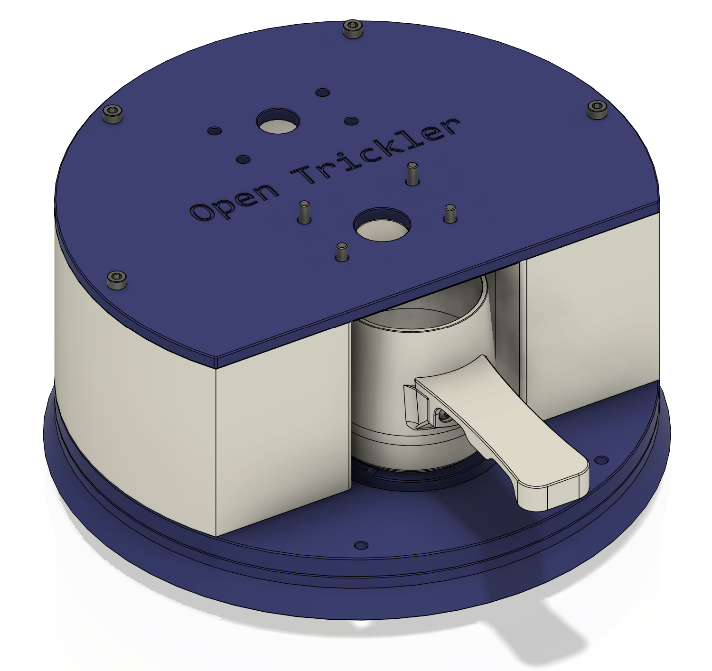
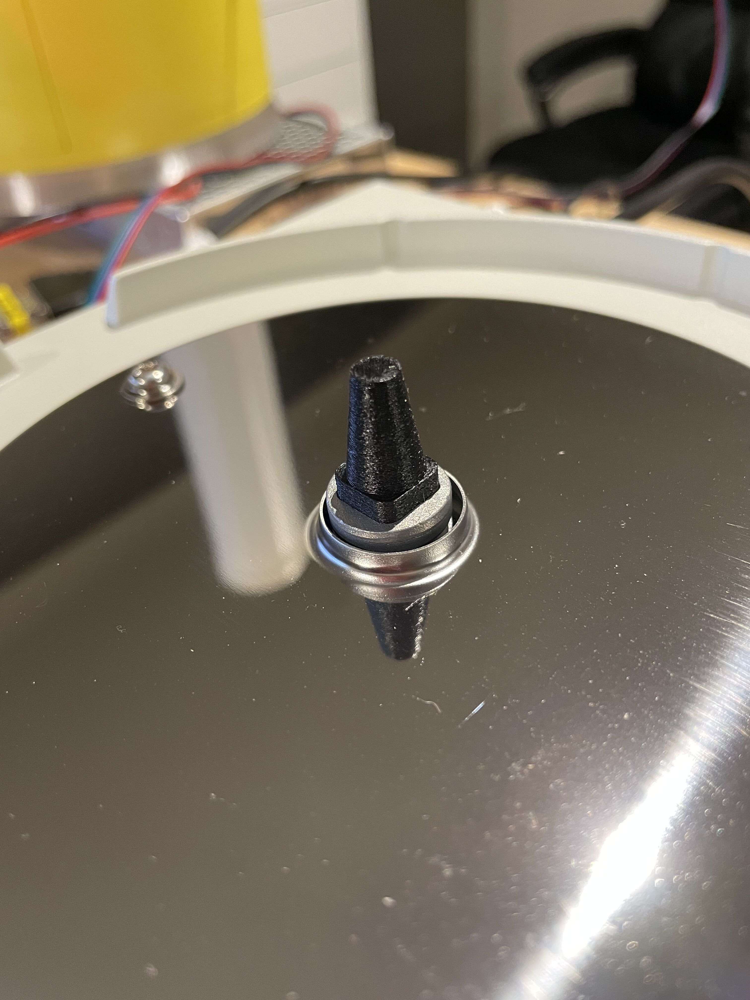
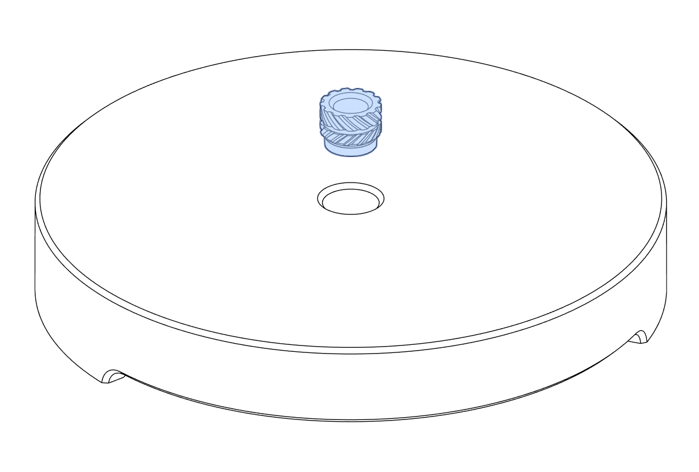
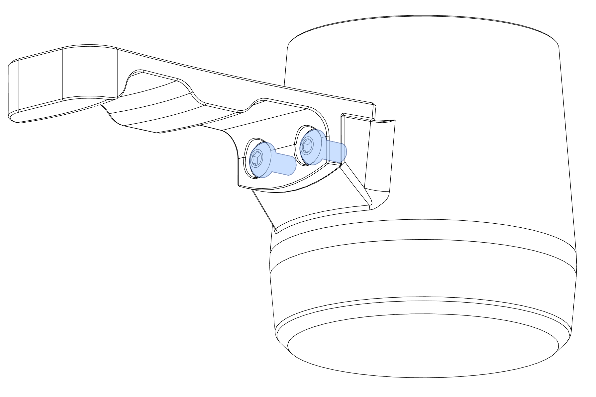
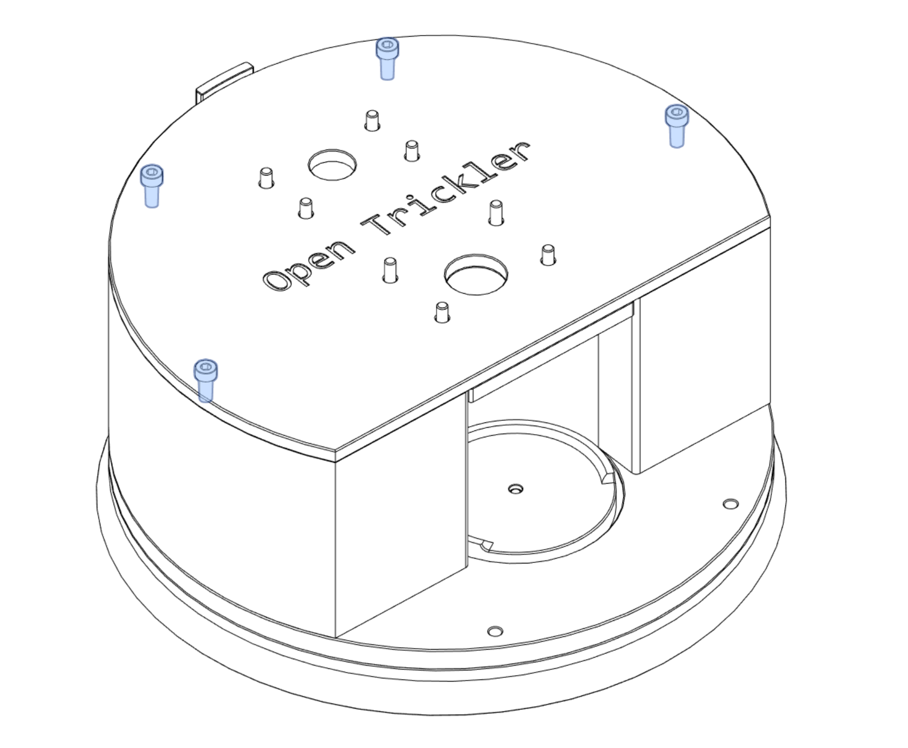
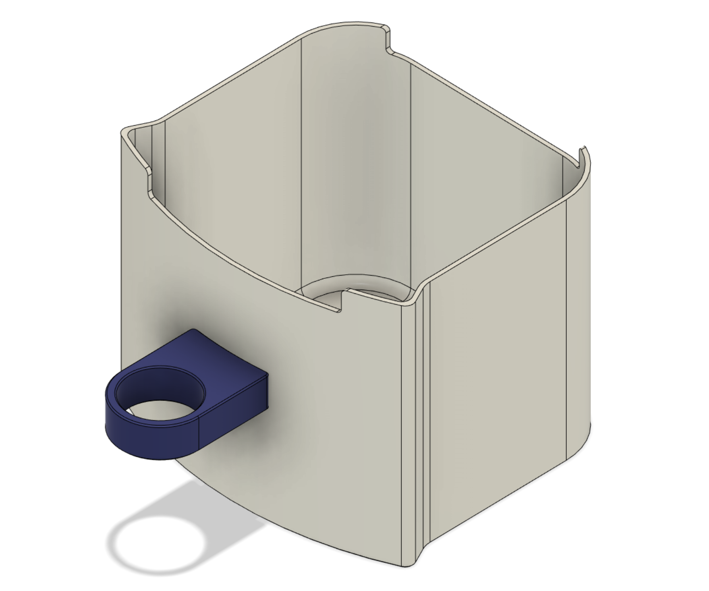

# A&D FX Shield Print and Assembly Guide

The OpenTrickler is designed to be mounted to the A&D FX Shield if you're using the A&D fx-120/300i series of precision scales. 

## Print Guide

| Filename                                                             | Quantity | Remarks        |
| -------------------------------------------------------------------- | -------- | -------------- |
| [cup_base_7mm.stl](cup_base_7mm.stl)                                 | 1        |                |
| [front_discharger_mount.stl](front_discharger_mount.stl)             | 1        |                |
| [pan_cover.stl](pan_cover.stl)                                       | 1        |                |
| [pan_cover_lid.stl](pan_cover_lid.stl)                               | 1        |                |
| [powder_cup_body.stl](powder_cup_body.stl)                           | 1        |                |
| [powder_cup_handle.stl](powder_cup_handle.stl)                       | 1        |                |
| [rear_discharge_cup_ring.stl](rear_discharge_cup_ring.stl)           | 1        |                |
| [rear_discharge_mount.stl](rear_discharge_mount.stl)                 | 1        |                |
| [rear_discharger_cup.stl](rear_discharger_cup.stl)                   | 1        |                |
| [rear_discharger_sliding_door.stl](rear_discharger_sliding_door.stl) | 1        |                |
| [scale_base_adapter_ring.stl](scale_base_adapter_ring.stl)           | 1        |                |
| [scale_pan_cover.stl](scale_pan_cover.stl)                           | 1        |                |
| [scale_shield.stl](scale_shield.stl)                                 | 1        |                |
| [scale_weighing_pan_adapter.stl](scale_weighing_pan_adapter.stl)     | 1        |                |
| [trickler_adapter_plate.stl](trickler_adapter_plate.stl)             | 1        |                |
| [weighing_pan_27mm.stl](weighing_pan_27mm.stl)                       | 1        | See note below |

### How to Print Weighing Pan?

You **DO NOT** need to enable support to print the weighing pan. The slicer (using the OrcaSlicer as example) will automatically recognize the floating surface as bridge (or Overhang if you're using PrusaSlicer). The slicer will automatically reduce the speed and flow, and increase the fan speed to print mid air. 

Using the [tutorial](https://help.prusa3d.com/article/poor-bridging_1802) to tune the slicer for better bridging performance. 

## BOM

| Name                   | Quantity | Remarks |
| ---------------------- | -------- | ------- |
| Heatset Inserts M3x5x4 | 15       |         |
| M3x6 BHCS              | 8        |         |
| M3x12 SHCS             | 4        |         |
| M3x10 SHCS             | 8        |         |
| M3x8 SHCS              | 7        |         |

## Tools

* 2.0 mm hex driver

* 2.5 mm hext driver

## Assembly of Weighing Pan

### Inspection

Insert the [scale_weighing_pan_adapter.stl](scale_weighing_pan_adapter.stl) to the square groove of the A&D FX-120i/300i scale bottom down, make sure the adapter can be inserted to be groove and seat firmly. If not, you may need to re-print with more or less flow ratio. 

### Component Prep

Melt 1x heatset insert into the bottom side of the [cup_base_7mm.stl](cup_base_7mm.stl). Make sure the heatset insert seats flush with the bottom surface.

Melt 1x heatset insert into to the [scale_weighing_pan_adapter.stl](scale_weighing_pan_adapter.stl). Make sure the heatset insert seats flush with the top surface.

### Assembly

Use 1x M3x6 BHCS to join the [weighing_pan_27mm.stl](weighing_pan_27mm.stl) with the [scale_weighing_pan_adapter.stl](scale_weighing_pan_adapter.stl).

Then use 1x M3x6 BHCS to join the [cup_base_7mm.stl](cup_base_7mm.stl) to the [weighing_pan_27mm.stl](weighing_pan_27mm.stl). 

### Put some money in the pocket

You need to provide some coins in all 3 pockets to increase the overall weight of the [weighing_pan_27mm.stl](weighing_pan_27mm.stl) to reach the minimum weight of A&D FX-120i/300i. The stock weighing pan is measured about 100 grams. Coins are needed to add up to this weight. 

What coin to use? Below is the reference table. 

| Coin            | Diameter | Weight | Minimum Quantity |
| --------------- | -------- | ------ | ---------------- |
| New Zealand \$2 | 26.5 mm  | 10 g   | 6                |
| Australia $1    | 25 mm    | 9 g    | 7                |
| Euro €2         | 25.75 mm | 8.5 g  | 7                |
| US $1           | 26.49 mm | 8.1 g  | 8                |

## Assembly of Poweder Cup

Powder cup assembly is straight forward. Two M3x6 BHCS are designed to be tapped into the [powder_cup_body.stl](powder_cup_body.stl) directly in order to join with the [powder_cup_handle.stl](powder_cup_handle.stl).

## Assembly of A&D FX Shield

### Component Prep

8x heatset inserts are to be melted into the plastic on both sides of the [scale_shield.stl](scale_shield.stl). 

### Assembly

Use 4x M3x12 SHCS to join [scale_base_adapter_ring.stl](scale_base_adapter_ring.stl), [scale_pan_cover.stl](scale_pan_cover.stl) and [scale_shield.stl](scale_shield.stl) together. 

Use 8x M3x10 SHCS to join the [trickler_adapter_plate.stl](trickler_adapter_plate.stl), with [front_discharger_mount.stl](front_discharger_mount.stl) and [rear_discharge_mount.stl](rear_discharge_mount.stl). Screws are to be
threaded to the bottom the OpenTrickler front and rear body. 

Use 4x M3x8 SHCS to join the trickler adapter assembly and scale shield assembly together. (The OpenTrickler body is hidden to for demonstration purpose).

## Assembly of Pan Cover

The pan cover is used to protect the pan from dust or accidental drops. The pan cover can be seamly
put onto the shield body when not used. 

### Component Prep

Melt 3x heatset inserts into the [pan_cover.stl](pan_cover.stl) from the top.

### Assembly

Install 2x M3x6 BHCS to the bottom of the [pan_cover.stl](pan_cover.stl). Do not over tighten those screws as they are designed to directly screw into the plastic. 

Use 3x M3x8 SHCS to join the [pan_cover_lid.stl](pan_cover_lid.stl) to the [pan_cover.stl](pan_cover.stl). 

## Assembly of Rear Discharge Cup

The discharge cup is used to help cleaning powder from the reservoir by catching remaining powder from the drainage hole. 

### Component Prep

Melt 2x heatset inserts into the [rear_discharge_cup_ring.stl](rear_discharge_cup_ring.stl). 

### Assembly

Use 2x M3x6 BHCS to join the [rear_discharge_cup_ring.stl](rear_discharge_cup_ring.stl) to the [rear_discharger_cup.stl](rear_discharger_cup.stl). 

Now you can slide the Rear Discharger Cup to the A&D FX Shield and finish the assembly. 