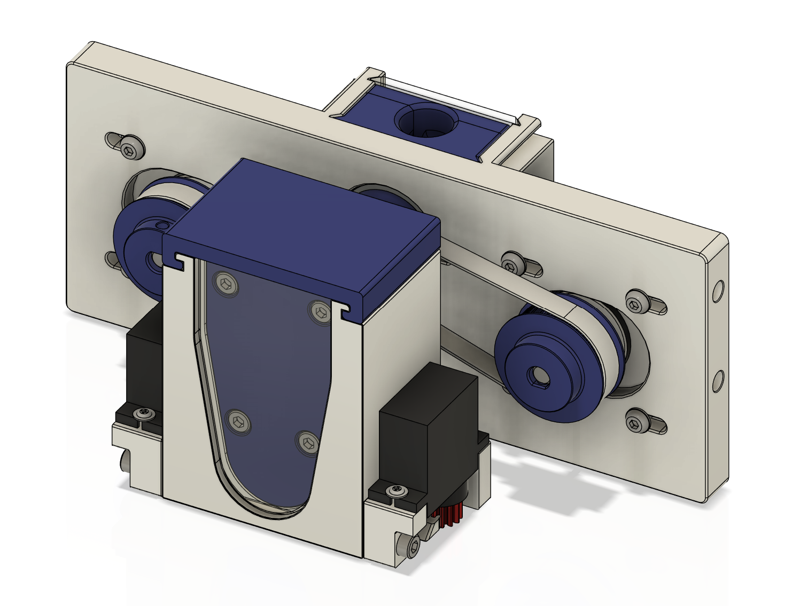
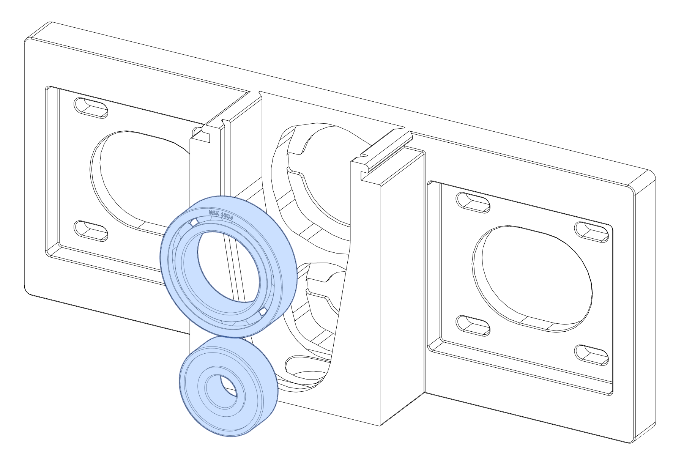
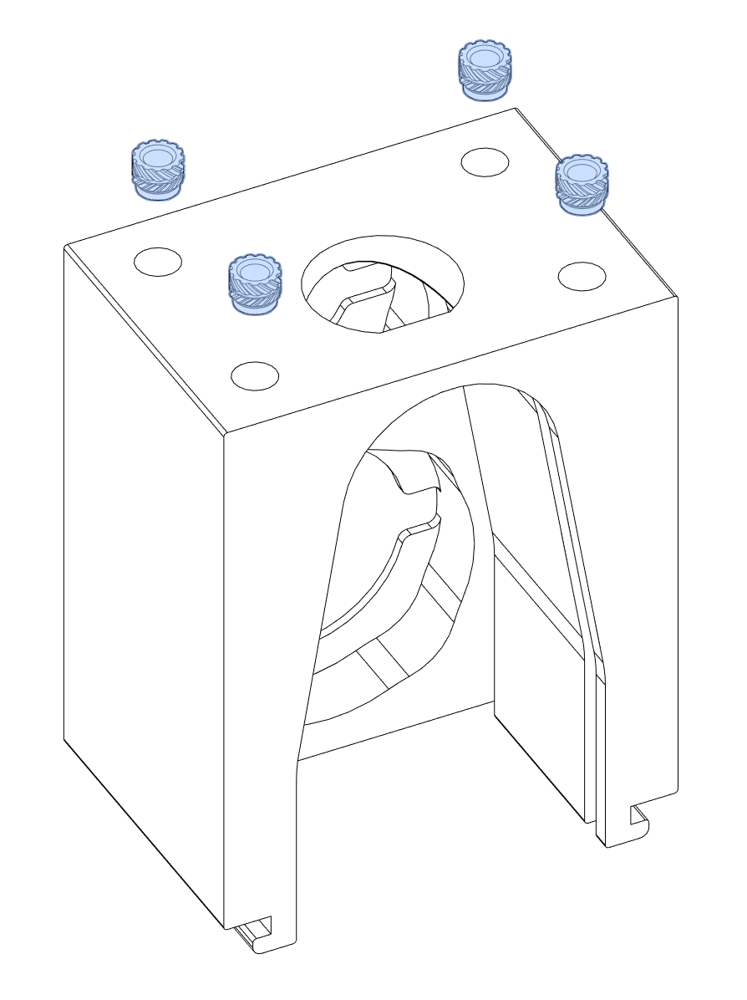
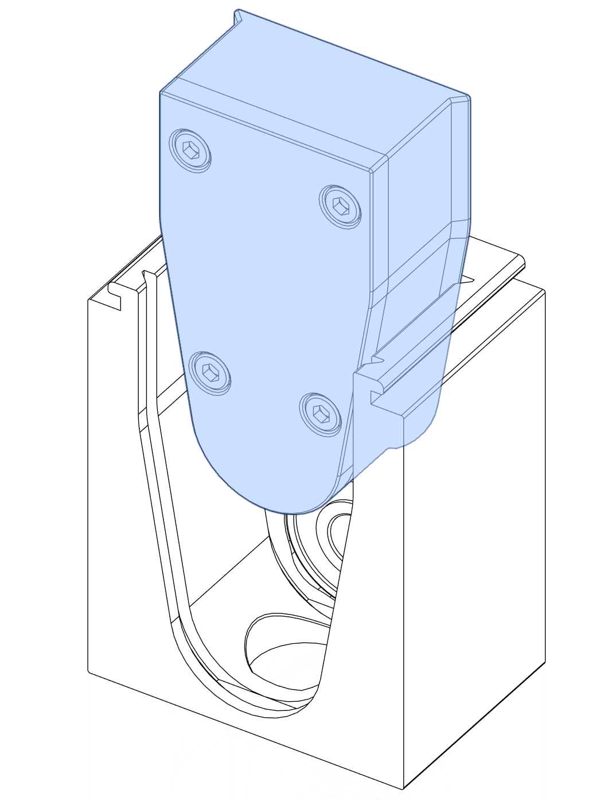
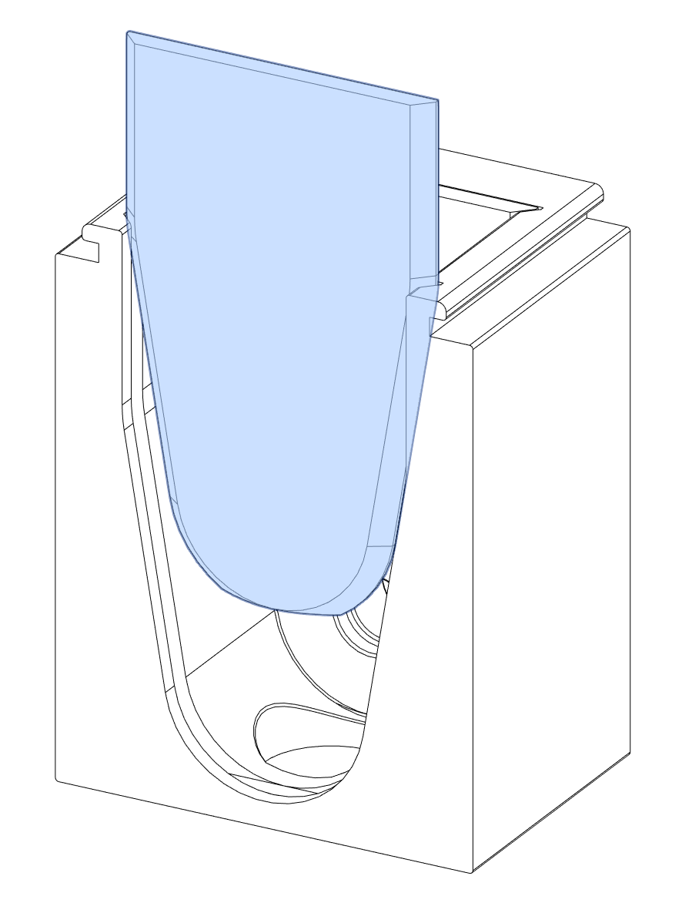
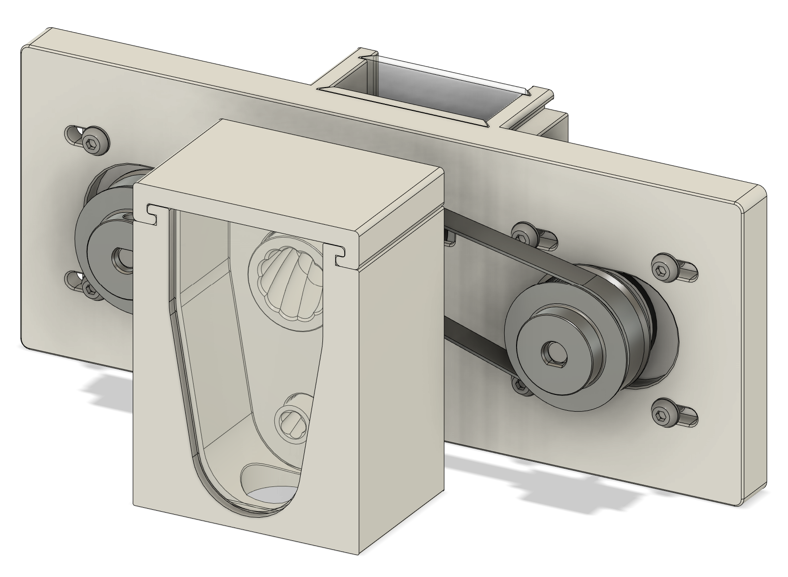
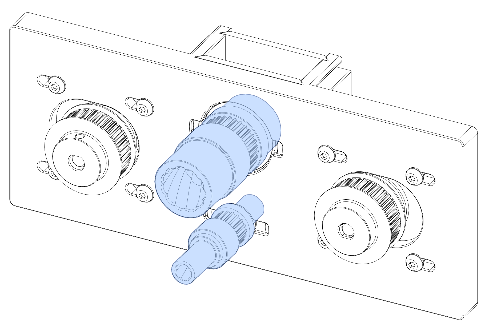
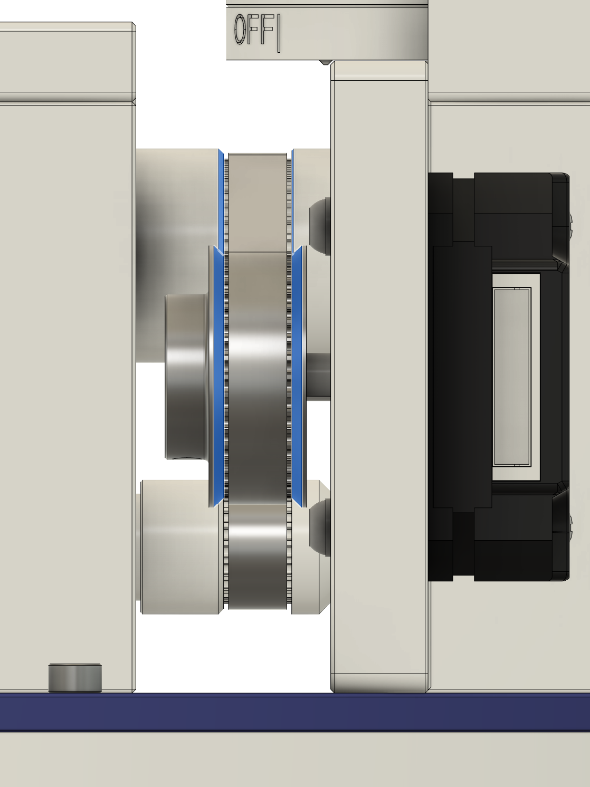

# OpenTrickler Print and Assembly Guide

## Print Guide

| Filename                                                 | Quantity | Alternative                                                                                                                                              | Remarks                                                                                                                                                                   |
| -------------------------------------------------------- | -------- | -------------------------------------------------------------------------------------------------------------------------------------------------------- | ------------------------------------------------------------------------------------------------------------------------------------------------------------------------- |
| [40_teeth_gt2_pulley_x2.stl](40_teeth_gt2_pulley_x2.stl) | 2        |                                                                                                                                                          | Can be substituted with aftermarket metal 40T pulley.                                                                                                                     |
| [bearing_cover_x2.stl](bearing_cover_x2.stl)             | 2        | Option 1: [bearing_cover_tighter_tolerance_x2.stl](Optional/bearing_cover_tighter_tolerance_x2.stl) Option 2: [VolumnReducer](Optional/VolumnReducer) | Option 1: 0.5mm tolerance for both trickler tube instead of 1mm.  Option 2: See description from the VolumReducer. Both will lock the bearings in the bearing pockets. |
| [front_body.stl](front_body.stl)                         | 1        | [ServoGate](Optional/ServoGate)                                                                                                                          | The optional servo gate allows the charge port to be shutted when the cup is removed. This enables powder to be pre-charged before the trickling process.                 |
| [front_body_cover.stl](front_body_cover.stl)             | 1        |                                                                                                                                                          |                                                                                                                                                                           |
| [front_rear_door_x2.stl](front_rear_door_x2.stl)         | 2        |                                                                                                                                                          | Recommended to print in translucent material.                                                                                                                             |
| [GT2_82T_Belt.stl](GT2_82T_Belt.stl)                     | 1        |                                                                                                                                                          | Can be substituted with aftermarket 83T (166 mm) GT2 belt. This part has to be printed in TPU or any flexible material.                                                   |
| [GT2_86T_Belt.stl](GT2_86T_Belt.stl)                     | 1        |                                                                                                                                                          | Can be substituted with aftermarket 87T (174 mm) GT2 belt. This part has to be printed in TPU or any flexible material.                                                   |
| [large_rotary_tube.stl](large_rotary_tube.stl)           | 1        |                                                                                                                                                          | Recommended to print with random Z seam position.                                                                                                                         |
| [rear_body.stl](rear_body.stl)                           | 1        |                                                                                                                                                          |                                                                                                                                                                           |
| [small_rotary_tube.stl](small_rotary_tube.stl)           | 1        |                                                                                                                                                          | Recommended to print with random Z seam position.                                                                                                                         |

## BOM

| **Name**               | **Quantity** | **Remarks**                 |
| ---------------------- |:------------ |:--------------------------- |
| Heatset Inserts M3x5x4 | 12           |                             |
| M3x8 BHCS              | 8            |                             |
| Shim Washer            | 8            | OD=6mm, ID=3mm, Thick=0.5mm |
| 6804 Bearing           | 2            |                             |
| 608 Bearing            | 2            |                             |
| Nema 17 Stepper Motor  | 2            |                             |

## Tools

* 2.5 mm hex driver

* 2.0 mm hex driver

## Assembly of Rear Body

### Component Prep

Melt 4x heatset inserts to the bottom of the [rear_body.stl](rear_body.stl). Make sure the heatset inserts are sitting flush with the surface.

### Assembly

Press 6804 bearing to the top bearing pocket and 608 to the bottom bearing pocket of [rear_body.stl](rear_body.stl). [Printable bearing insert helpers](Tools) are supplied to use with benchtop vise if the bearings can't be pressed in by hands. 

For the next step, you have three options

1. [bearing_cover_x2.stl](bearing_cover_x2.stl): Slide the bearing cover to the rear cut out. The cover should sit flush with the top of the rear body, while two bearings are still free to rotate without resistance.
   If you can feel the abnormal resistance after installing the bearing cover, press the bearings inwards for additional 0.1mm to clear the interference.
   

2. [bearing_cover_tighter_tolerance_x2.stl](Optional/bearing_cover_tighter_tolerance_x2.stl): The procedure is identical to option 1 but with the bearing cover with slightly tigher tolerance. 

3. [VolumnReducer](Optional/VolumnReducer): Slide the rear volumn reducer assembly to the rear cut out. The cover should sit flush with the top of the rear body, while two bearings are still free to rotate without resistance.
   

Use 8x M3x8 BHCS screws with the optional M3 shim washers to mount two stepper motors onto the [rear_body.stl](rear_body.stl), but don't tighten them yet. Make sure the motor can slide left to right.

Slide 2x [40_teeth_gt2_pulley_x2.stl](40_teeth_gt2_pulley_x2.stl) to the motor shaft but don't tighten the set screws yet. The pulley height will be adjusted in the later step.

Slide the [front_rear_door_x2.stl](front_rear_door_x2.stl) to the cut out and the [rear_body.stl](rear_body.stl) to finish the assembly. 

## Assembly of Front Body

*Note: If you're looking to build the Servo Gate, you need to follow the [servo gate build guide](Optional/ServoGate/README.md) first before continue.*

### Component Prep

Melt 4x heatset inserts to the bottom of the [front_body.stl](front_body.stl). Make sure the heatset inserts are sitting flush with the surface.

### Assembly

Press 6804 bearing to the top bearing pocket and 608 to the bottom bearing pocket. [Printable bearing insert helpers](Tools) are supplied to use with benchtop vise if the bearings can't be pressed in by hands.

For the next step, you have three options

1. [bearing_cover_x2.stl](bearing_cover_x2.stl): Slide the bearing cover to the rear cut out. The cover should sit flush with the top of the rear body, while two bearings are still free to rotate without resistance.If you can feel the abnormal resistance after installing the bearing cover, press the bearings inwards for additional 0.1mm to clear the interference.
    

2. [bearing_cover_tighter_tolerance_x2.stl](Optional/bearing_cover_tighter_tolerance_x2.stl): The procedure is identical to option 1 but with the bearing cover with slightly tigher tolerance.

3. [VolumnReducer](Optional/VolumnReducer): Slide the front volumn reducer assembly to the rear cut out. The cover should sit flush with the top of the front body, while two bearings are still free to rotate without resistance.
    

Slide the [front_rear_door_x2.stl](front_rear_door_x2.stl) to the cut out, the front door should sit flush with the top of the [front_body.stl](front_body.stl).

Slide the [front_body_cover.stl](front_body_cover.stl) to the groove top of the [front_body.stl](front_body.stl) then the front body assembly is complete.

## Assembly of Open Trickler Front and Rear Body

### Assembly

Insert both [large_rotary_tube.stl](large_rotary_tube.stl) and [small_rotary_tube.stl](small_rotary_tube.stl) through the rear bearing. You may experience some resistance subject to the 
tolerance of the printed part. 

Slide the motor towards rotary tubes to the nearest position. Once done, slide the belt onto rotary tubes and pulleys. Make
sure the longer belt is connected to the motor on the right side. **Do not tension the belt, nor adjust the depth of the pulley for now.**

Slide the front body over the rotary tubes through bearings. You need to push the front body all the way in. 

The OpenTrickler is now assembled. In the later steps the OpenTrickler will be mounted to one of the scale adapter for final assembly.

## Post Installation Adjustments

Assuming you have already built the suitable scale shield and attached the OpenTrickler to it, you can finalize the installation by tensioning the belt. 

### Adjust Pulley Depth

Look through the unit from the left and right side, push or pull the pulley on the shaft to align the flange with the rotary tubes.

### Tension The Belt

You need to adjust the tension of the belt. First loosen 8x M3x8 BHCS used to secure stepper motors. 
Then pull motors slightly to tension the belts. Once done, tighten all 8 screws. 

# Congratulations

Your Open Trickler is now assembled!
